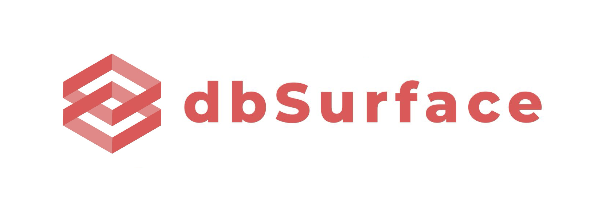

<h1 align="center">
  
</h1>

[dbSurface](https://dbsurface.com) is the SQL editor made for pgvector.

---

### Get Started

(Docker setup)

### Support

If you're missing a feature, have a question, or have found a bug, please open a
[GitHub Issue](https://github.com/Z-Gort/dbSurface/issues/new).

### Notes on Projection Creation

How long projection creation takes depends mostly on the restricted connection string you input. A few million rows can take anywhere from ~15-55 minutes depending on the concurrent connection limit on the connection string and database egress bandwith limits. 

We have tested with about 30 concurrent connections you can achieve ~25 minute creation on 2 million rows, but if you are able to set concurrent connections higher you can reduce this. 

Also ensure before creating a projection your restricted connection is not being used for any critical tasks, and note modifying your schema while a projection is being created may cause creation failure.

